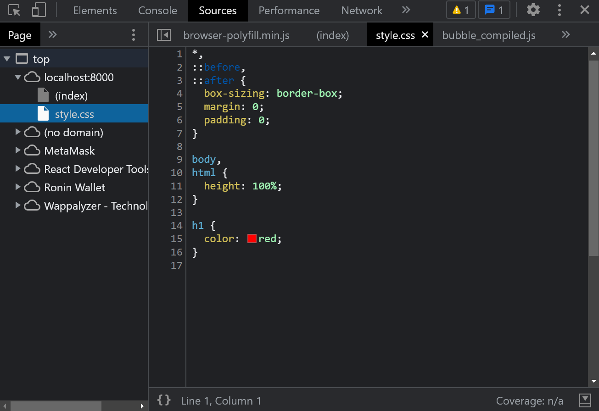

# odin-basic-node-site

A simple Node.js backend application (without Express.js) to route static HTML pages & CSS stylesheets to the client.

# Setup

```shell
git clone git@github.com:Luzefiru/odin-basic-node-site.git
cd ./odin-basic-node-site
npm run start
```

# Serving Static CSS Files Without a Framework

An HTML file served by the server after a client initially gets it, can send another `'GET'` request to the server for any `href=` or `src=` files needed.

For example, here is `index.html` which is served when the client navigates to `host:port/`:

```html
<!-- index.html -->
<head>
  <meta charset="UTF-8" />
  <meta http-equiv="X-UA-Compatible" content="IE=edge" />
  <meta name="viewport" content="width=device-width, initial-scale=1.0" />
  <title>Node Site</title>
  <link rel="stylesheet" href="style.css" />
</head>
```

This HTML file then issues another `'GET'` request to resolve the `href="style.css"`. Therefore, I handled it by analyzing the `request.url` for any file extensions ending with `.css` to serve the respective file.

```js
/* src/app.js */
if (req.url.indexOf('.css') != -1) {
  body = returnCSS(req.url);
  res.writeHead(200, { 'Content-Type': 'text/css' });
  res.write(body);
  res.end();
}
```

```js
/* src/utils.cjs */
function returnCSS(fileName) {
  const string = fs.readFileSync(
    path.resolve(__dirname, `../public/css/${fileName}`),
    'utf-8'
  );
  return string;
}
```

This results in the serving of both `index.html` & the href'd `style.css`:



# Reference

These were the requirements in The Odin Project's [Project: Basic Informational Site](https://www.theodinproject.com/lessons/nodejs-basic-informational-site) page in order to practice pure Node.js server-side programming.
